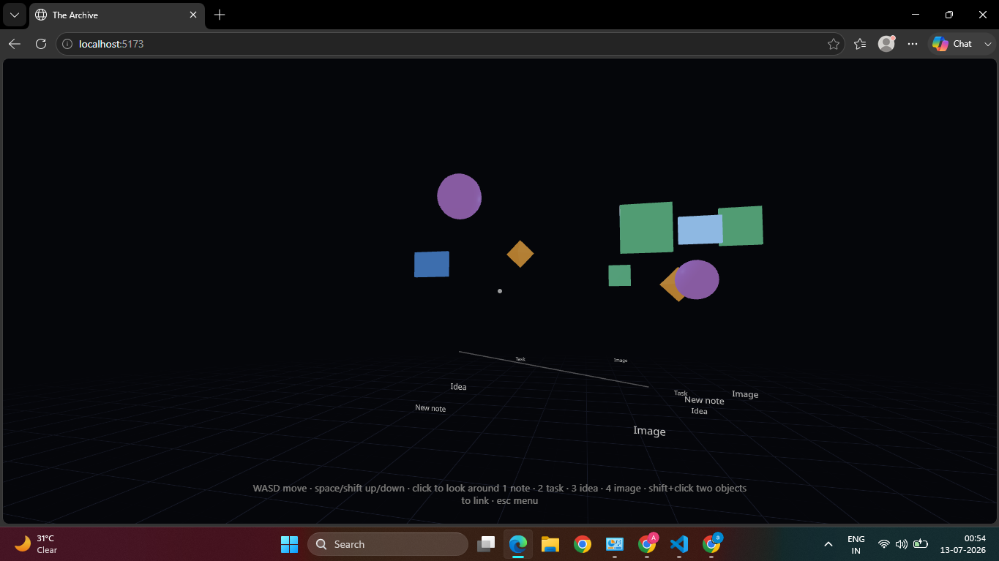
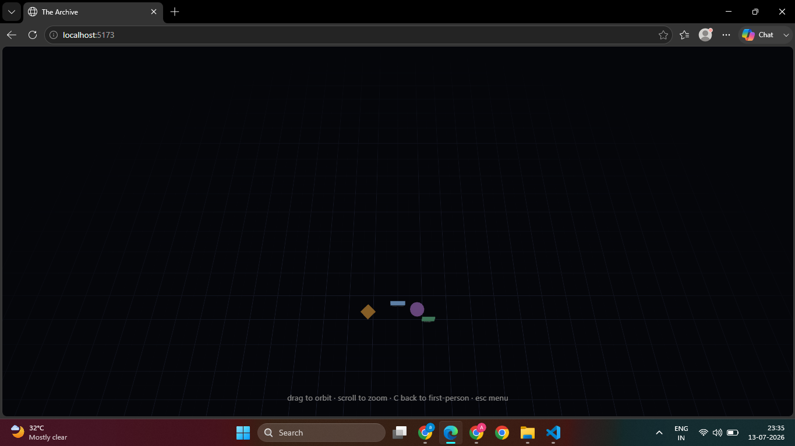

# The Archive

**A living spatial mindspace** — a persistent 3D workspace where notes,
tasks, ideas, and images exist as physical objects you place, carry, link,
and organize by walking through the space, with an AI curator that lives
inside the world and actively helps organize it.

Built with React Three Fiber (Three.js) so it runs entirely on modest
hardware — no dedicated GPU required, no heavy game-engine install.



## Demo Video

Watch the full project demo here:

[](https://www.youtube.com/watch?v=U8hX6osK43A)

## Technical Report

**[Read the Technical Report](The-Archive-Technical-Report.pdf)**

---

## Table of contents

- [What this is](#what-this-is)
- [Features](#features)
- [Controls](#controls)
- [Setup — running in the browser](#setup--running-in-the-browser)
- [Setup — running as a desktop app (Electron)](#setup--running-as-a-desktop-app-electron)
- [Building the submission executable](#building-the-submission-executable)
- [AI curator setup](#ai-curator-setup)
- [Architecture](#architecture)
- [Project structure](#project-structure)
- [Known limitations](#known-limitations)

## What this is

Most digital workspaces are flat — folders, tabs, lists. The Archive puts
your notes, tasks, ideas, and images inside an actual 3D space you walk
through, carry things around in, and physically connect to each other. The
space remembers exactly how you left it, and an AI curator embedded in the
world (not a chat sidebar bolted on the side) helps you notice connections
you might not have drawn yourself.

## Features

**Navigate & explore**
Free-flying WASD movement with mouse-look (pointer-lock, FPS-style). A
crosshair reticle targets whatever you're looking at — no mouse-click
menus.

**Create & manipulate objects spatially**
- `1`–`4` spawn a note / task / idea / image in front of you
- `E` picks up whatever's under your crosshair and carries it with you;
  `E` again drops it
- Scroll wheel scales a carried object; `Z`/`X` rotate it
- `L` links two objects into a visible knowledge-graph thread
- `R` renames via an in-world panel; `Backspace` deletes

**Persistent world state**
Every change is saved automatically. In the browser this uses
`localStorage`; the Electron build backs it with a real JSON file on disk,
so your space survives a full reinstall or move to another machine.

**Object-based knowledge graph + constellation view**
Linked objects form a visible 3D graph you build by hand. Press `C` to pull
back into a free-orbiting bird's-eye view of the whole graph at once.



**AI Curator (agentic AI, embedded in the world)**
A small light entity that physically inhabits the space rather than a
chatbot panel:
- Greets you at the start of each session referencing your *actual*
  objects and what it noticed last time (contextual memory across
  sessions, persisted in the save file)
- `G` asks it to scan the space and propose semantic connections — shown
  as dashed preview links you accept (`Y`) or dismiss (`N`) before they
  become permanent
- `T` opens a natural-language chat with it — it answers grounded in your
  real workspace, not generically
- Its movement is context-driven: it holds still while "thinking," hovers
  over the pair of objects it's proposing to link, follows whatever you're
  carrying, and drifts toward whatever you're currently looking at — never
  an independent random wander

**Living memory & reactive atmosphere**
Objects glow brighter the more recently you've touched them and the more
richly they're connected; forgotten ones slowly dim. Ambient lighting and
fog shift warmer and clearer as the space becomes more organized, cooler
and foggier when it's cluttered and disconnected — the environment itself
reflects how you've been using it.

**Onboarding & help**
First-time entry shows a control summary; `H` reopens it anytime.

## Controls

| Key | Action |
|---|---|
| `W A S D` | Move |
| `Space` / `Shift` | Up / down |
| Mouse | Look around (click to lock pointer) |
| `1` `2` `3` `4` | Spawn note / task / idea / image |
| `E` | Pick up / drop the targeted object |
| Scroll (while carrying) | Scale the object |
| `Z` / `X` (while carrying) | Rotate the object |
| `L` | Start / complete a link between two objects |
| `R` | Rename the targeted/carried object |
| `Backspace` | Delete the targeted/carried object |
| `G` | Ask the curator to propose connections |
| `Y` / `N` | Accept / dismiss the curator's suggestions |
| `T` | Talk to the curator |
| `C` | Toggle constellation (bird's-eye) view |
| `H` | Reopen the controls help panel |
| `Esc` | Cancel current action / return to menu |

## Setup — running in the browser

Requires [Node.js](https://nodejs.org) (LTS).

```bash
npm install
npm run dev
```

Open the printed `localhost` URL, click "Enter," then click into the canvas
to lock the pointer.

## Setup — running as a desktop app (Electron)

```bash
npm run electron:dev
```

Launches Vite's dev server and an Electron window pointed at it — same fast
reload loop as the browser, but world saves go to a real file on disk
instead of `localStorage`.

## Building the submission executable

```bash
npm run electron:build
```

Produces both a portable standalone executable and an NSIS installer in
`release/`:

- **`The Archive <version>.exe`** — portable, no installation required.
  This is the intended "Executable Build" deliverable.
- **`The Archive Setup <version>.exe`** — installer, optional.

> Windows SmartScreen will flag the executable as unrecognized ("Windows
> protected your PC") since it isn't code-signed — this is expected for any
> unsigned indie/student build, not a bug. Click "More info" → "Run
> anyway."

> **Windows-specific build note:** `electron-builder` downloads a code-signing
> helper package on first run that requires symlink privileges Windows
> restricts by default. If the build fails with a `Cannot create symbolic
> link` error, either enable **Developer Mode** (Settings → Privacy &
> security → For developers) or run the build command from an
> Administrator terminal, then retry.

## AI curator setup

Copy the environment template and add your key:

```bash
cp .env.example .env
```

Edit `.env`:
```
VITE_LLM_PROVIDER=gemini
VITE_LLM_API_KEY=your_key_here
```

Get a free key at [aistudio.google.com](https://aistudio.google.com) → "Get
API key." Restart the dev server after editing `.env` — environment
variables are only read at startup. Without a key, the curator degrades
gracefully to generic stub messages rather than breaking.

## Architecture

### Overview

The Archive is a client-rendered 3D application built with React Three
Fiber (a React renderer for Three.js), state-managed by Zustand, and
optionally wrapped in Electron for a native desktop build. There is no
backend server — all logic runs client-side, and persistence is local
(browser storage or a local file, depending on how it's run).

The design goal throughout was that **the AI curator and the spatial
interaction model should reinforce each other**, rather than being two
separate features bolted together: the knowledge graph is the meaningful
spatial system, and the curator is an entity that lives inside that same
graph and actively shapes it.

### System diagram

```
┌───────────────────────────────────────────────────────────────┐
│                      Electron desktop app                     │
│                                                                 │
│   ┌─────────────────────┐        ┌───────────────────────┐   │
│   │   3D world           │        │   AI curator agent     │   │
│   │  (React Three Fiber) │◄──────►│  (src/ai/curatorAgent) │   │
│   └──────────┬───────────┘        └───────────┬───────────┘   │
│              │                                 │               │
│              ▼                                 ▼               │
│   ┌─────────────────────────────────────────────────────┐     │
│   │        Zustand store (src/state/store.js)            │     │
│   │   objects · curatorLog · view/session state           │     │
│   └──────────────────────┬────────────────────────────────┘   │
│                           │                                     │
│                           ▼                                     │
│   ┌─────────────────────────────────────────────────────┐     │
│   │   Persistence layer (src/state/persistence.js)        │     │
│   │   localStorage (browser)  or  JSON file (Electron)    │     │
│   └─────────────────────────────────────────────────────┘     │
└───────────────────────────────────────────────────────────────┘
                            │
                            ▼ (curator only)
                  ┌───────────────────┐
                  │   Cloud LLM API    │
                  │   (Gemini)         │
                  └───────────────────┘
```

### Core data model

A single array of **knowledge objects** in the Zustand store is the entire
world state:

```js
{
  id, type,            // 'note' | 'task' | 'idea' | 'image'
  label,
  position: [x, y, z],
  scale, rotationY,     // spatial transform, editable while carried
  color,
  links: [otherId, ...], // undirected adjacency - the knowledge graph
  createdAt, lastTouched // drives the living-memory glow
}
```

Everything the app does — rendering, persistence, the curator's reasoning
— reads and writes this one structure. There's no separate "graph" data
structure; the graph is just the `links` arrays on the objects themselves,
which keeps persistence trivial (it's one JSON blob) and keeps the curator
and the renderer looking at exactly the same source of truth.

### Why Zustand as the single source of truth

Every interactive system in the brief — object manipulation, persistence,
the AI agent, atmosphere — needs to read and sometimes write the same
world state. Rather than threading props through the component tree or
splitting state across contexts, everything funnels through one Zustand
store (`src/state/store.js`). Components subscribe only to the slices they
need (e.g. `KnowledgeObject` reads `targetedId`/`carryingId` but not the
curator's chat state), so updates stay cheap despite the shared store.

Two persistence tiers exist deliberately:
- **Discrete actions** (`updateObject`, `beginOrCompleteLink`, `deleteObject`)
  persist immediately — these are rare, user-intentional edits.
- **Continuous actions** (`moveObjectLive`, `scaleObjectLive`,
  `rotateObjectLive`) do **not** persist on every call — they run every
  animation frame while an object is being carried. Persisting 60 times a
  second would be wasteful and, in the Electron build, would mean 60
  synchronous disk writes per second. Instead, `persist()` is called once
  when the object is dropped.

### Why the interaction model is crosshair + keyboard, not mouse-click

The camera uses `PointerLockControls` for FPS-style look-around, which
captures the mouse for camera rotation — there is no free on-screen cursor
to click precise 3D targets with. Rather than fight that, `Interactions.jsx`
raycasts once per frame from the exact center of the screen (the crosshair)
to determine what's being looked at (`targetedId`), and all manipulation
happens via keyboard (`E` to carry, `L` to link, scroll/`Z`/`X` to
transform). This keeps every interaction spatial — you interact with what
you're looking at, not what you happen to click — which was a deliberate
fit for the brief's "interactions should happen naturally inside the 3D
world rather than through standard UI panels."

### The AI curator

`src/ai/curatorAgent.js` isolates every LLM-provider-specific detail behind
three functions (`summarizeSessionStart`, `suggestClusters`, `askCurator`),
each of which builds a prompt from the *live* object list (and, for session
start and chat, the persisted `curatorLog`) and returns plain text or
structured JSON. Swapping providers is a one-line change in the internal
`callLLM()` function; nothing else in the app knows which provider is in
use.

The curator is deliberately **not** a chat sidebar. `CuratorEntity.jsx` is a
physical light entity rendered inside the 3D scene whose movement is
state-driven rather than freely wandering:

1. While waiting on an API response, it holds still ("thinking").
2. While it has a pending cluster suggestion, it hovers directly between
   the two objects it's proposing to connect.
3. While the user is carrying an object, it stays near that object.
4. Otherwise it drifts toward whatever the user is currently looking at.
5. Only with no other signal does it idly drift among existing objects.

This priority chain is what makes its motion read as attentive rather than
decorative — a judge watching the demo can see *why* it's moving, without
narration.

Required agentic behaviors this satisfies: contextual memory across
sessions (curator log persisted, referenced in the session-start greeting),
proactive assistance (`G` unprompted-feeling suggestion flow), semantic
understanding (clustering reasoning is grounded in actual object labels,
not random pairing), and natural-language interaction (`T` chat, grounded
in real workspace state).

### Persistence abstraction

`src/state/persistence.js` exposes `loadWorld()`/`saveWorld()` with no
knowledge of *where* data actually goes. At runtime it checks for
`window.archiveAPI` (only present in the Electron build, injected by
`electron/preload.cjs` via `contextBridge`) and uses that; otherwise it
falls back to `localStorage`. The rest of the app — the store, every
component — calls the same two functions regardless of which environment
it's running in. `electron/main.cjs` backs the Electron path with a real
JSON file in the OS-appropriate user data directory, so the desktop build's
save survives even a full app reinstall.

### Atmosphere & living memory

Two systems make the environment feel reactive rather than static, both
computed live from the same object data rather than being separately
tracked state:

- **Living memory** (`KnowledgeObject.jsx`): each object's emissive glow is
  a function of how recently it was touched (`lastTouched`) and how many
  links it has. No separate "decay" system runs in the background — it's
  recomputed from timestamps every frame.
- **Atmosphere** (`AtmosphereController.jsx`): ambient light intensity,
  point light color/intensity, and fog distance all lerp toward targets
  computed from a single "organization" score (total links relative to
  object count) each frame.

### Known trade-offs

- Constellation view uses a second, independent camera + `OrbitControls`
  rather than repurposing the FPS camera, specifically to avoid conflicts
  with `PointerLockControls` state. This was simpler and more robust than
  trying to make one camera serve both interaction modes.
- The curator's clustering pass is triggered on demand (`G`) rather than
  running continuously in the background, to keep API usage predictable
  and avoid surprising the user with objects re-linking themselves
  unprompted.

## Project structure

```
the-archive/
├── electron/              # Desktop shell (main process + preload)
├── docs/
│   └── screenshots/
├── src/
│   ├── ai/                # AI curator - LLM interface & prompts
│   ├── scene/              # 3D world - movement, objects, curator entity,
│   │                        atmosphere, links, interactions
│   ├── state/              # Zustand store + persistence abstraction
│   ├── ui/                 # Screen-space overlays (menu, HUD, panels)
│   ├── App.jsx
│   └── main.jsx
├── package.json
└── vite.config.js
```

## Known limitations

- Object geometry is simple primitives per type rather than rich per-object
  visuals (e.g. notes don't render their actual text on their face).
- The curator's clustering suggestions are single-shot per `G` press rather
  than continuously running in the background.
- Tested primarily on Windows with integrated graphics; other platforms
  should work (Electron/Three.js are cross-platform) but are untested.
